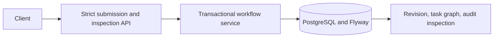

# Architecture and implementation boundaries

## Foundation behavior

`WorkflowController` accepts a validated requirement DTO. `WorkflowService`
creates a workflow, immutable requirement revision, pending interpretation task
and audit event in one JDBC transaction. Inspection returns those persisted records.
There is no scheduler or executor bean and no endpoint for externally supplied state.

## Intended execution architecture

The control plane owns workflow/revision identities, dependency gates, approvals,
policy decisions and audit lineage. The execution plane uses `Agent`,
`AgentExecutor`, `ModelProvider`, `EngineeringTool`, `EngineeringArtifact`,
`ArtifactValidator`, `ValidationResult`, `ExecutionAttempt`, `RetryPolicy`,
`FallbackStrategy`, `RollbackAction` and `RepositoryWorkspace` contracts.

Agents will propose structured file operations. Only a policy-controlled tool will
apply the exact proposals inside revision-isolated workspaces. The build tool will
run the fixed Maven Wrapper verification capability. Artifact and feature validators,
not provider narratives or API callers, will determine exit-gate success.

Deterministic agents will support explicitly documented URL-shortener capabilities.
Unsupported requirements will pause or stop safely. General arbitrary-repository
engineering is not claimed. Optional external models follow a working deterministic
execution chain.

## Persistence decisions

- JDBC makes transaction and evidence writes explicit; migrations own schema changes.
- UUIDs identify records; SHA-256 identifies requirement and artifact content.
- UTC timestamps are truncated to microseconds to round-trip through PostgreSQL.
- Composite foreign keys prevent cross-revision dependencies, artifacts, attempts,
  validation, approvals and audit associations. Approvals and validation reference
  an exact artifact hash, not an unqualified identifier.
- Revision numbers and task keys are unique within their owners. Attempts are
  unique per task/number. Terminal attempt records require completion and evidence.
- Structured payloads use text storage in this foundation for portability and
  explicit schema validation by application contracts. Database content hashes are
  not automatically recomputed; trusted application writers must validate content.
- Task dependency cycle detection, scheduling, optimistic updates and gate enforcement
  arrive in later checkpoints. Database state enums alone do not enforce readiness.

The bootstrap interpretation task is an intake task, not a fixed engineering plan.
Requirement-specific engineering graph expansion follows in commit 2.

## Security and trade-offs

No filesystem tool, process runner, approval mutation or completion API is exposed.
Strict JSON parsing protects the caller/executor boundary; error responses suppress
SQL, parser internals and rejected values. Audit metadata records a hash rather than
duplicating the full requirement. Requirement text itself is persisted for lineage.

Foundation endpoints are unauthenticated and intended for local review. Operator
authorization, database privilege separation and deployment protection are pending.
Audit records have an append-only application surface; a database owner can still
alter them. Audit-grade deployment hardening must not be inferred from this schema.

A fixed Maven invocation is not a sandbox: target build plugins execute code.
Restricted build workers without platform secrets are required before process tools
are enabled. Shared-workspace writes will be serialized; independent proposals can
run concurrently. Two-worker leases/fencing and crash recovery are not implemented.
